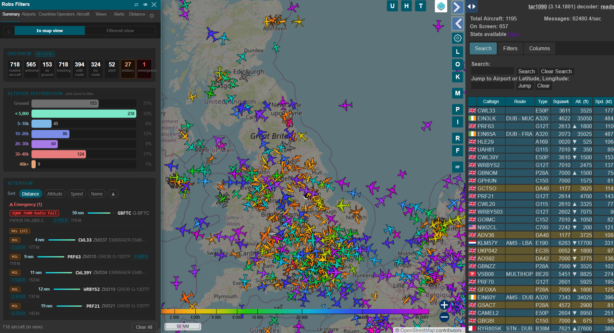
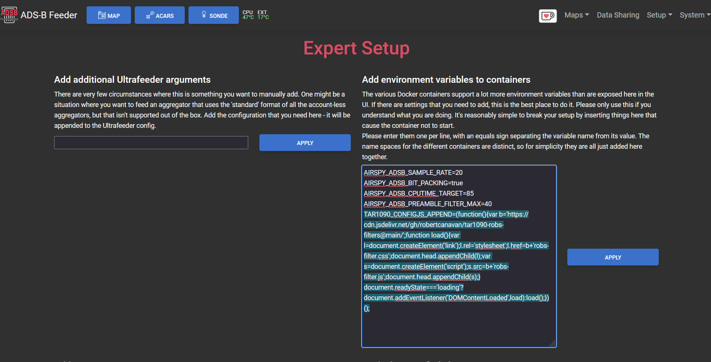

# Robs Filters for tar1090

A multi-tab filter and dashboard panel for [tar1090](https://github.com/wiedehopf/tar1090). Click the **RF** button in the tar1090 header to open a sidebar packed with live filtering, statistics, and tracking tools.

Filters AND across tabs — a plane has to pass every active tab to stay on the map. Within a tab, multiple selected items are OR-ed.

Active filters appear as **breadcrumb chips** below the tab bar so you can see at a glance what is applied, jump back to a tab by clicking the chip, or clear it with the X. When a saved View is active it also appears as a chip showing the view name and map mode, with a one-click Turn Off button.

---

## Screenshots



| Summary | Aircraft |
|---|---|
|  |  |

| Countries | Operators |
|---|---|
|  |  |

---

## Install

### docker-compose.yml

Add to your tar1090 environment:

```yaml
- TAR1090_CONFIGJS_APPEND=(function(){var b='https://cdn.jsdelivr.net/gh/robertcanavan/tar1090-robs-filters@main/';function load(){var l=document.createElement('link');l.rel='stylesheet';l.href=b+'robs-filter.css';document.head.appendChild(l);var s=document.createElement('script');s.src=b+'robs-filter.js';document.head.appendChild(s);}document.readyState==='loading'?document.addEventListener('DOMContentLoaded',load):load();})();
```

Then `docker compose up -d`. No rebuild needed.

---

### ADSB.im feeder

1. Open your feeder web UI and go to **Setup**
2. Click **Expert** at the top
3. Under **Add environment variables to containers**, paste:

```
TAR1090_CONFIGJS_APPEND=(function(){var b='https://cdn.jsdelivr.net/gh/robertcanavan/tar1090-robs-filters@main/';function load(){var l=document.createElement('link');l.rel='stylesheet';l.href=b+'robs-filter.css';document.head.appendChild(l);var s=document.createElement('script');s.src=b+'robs-filter.js';document.head.appendChild(s);}document.readyState==='loading'?document.addEventListener('DOMContentLoaded',load):load();})();
```



---

## Tabs

### Summary

Opens by default. A live dashboard of everything on screen — no filtering needed, just open it and see what's happening.

**Overview** — total aircraft, airborne vs on ground, military count, emergency count.

**Altitude distribution** — bar chart showing how many aircraft are at each altitude band. Click any band to instantly filter the map to just those aircraft.

**Attention** — flags anything worth looking at:
- Emergency squawks (7500/7600/7700) with code descriptions
- Military aircraft — click the header to filter all military on the map
- Low altitude airborne aircraft that look unusual

Each row in Attention shows the aircraft's distance from your receiver in nautical miles, plus a proximity bar scaled relative to the other aircraft in the current Attention set so the nearest aircraft always has a full bar.

Sort the Attention list by **Distance / Altitude / Speed / Name** with an ascending/descending toggle. Only aircraft with a live position are included.

**Closest aircraft** — top 5 nearest to your receiver, with distance in nautical miles.

**Speed leaders** — fastest aircraft on screen with a speed bar. Click any to filter to that aircraft.

**Slowest airborne** — opposite of speed leaders. Useful for spotting helicopters and light aircraft.

**High flyers** — top aircraft by altitude with a bar chart.

**Aircraft types** — most common type codes currently visible.

**Busiest operators** — airline/operator with the most aircraft on screen.

**Busiest routes** — most active departure-arrival pairs with flag emojis.

**Tracking methods** — breakdown of ADS-B / MLAT / TIS-B / Mode S.

**Range & coverage** — furthest aircraft from your receiver, with compass bearing and direction.

**Recent Arrivals** — aircraft that first appeared on scope in the last 5 minutes, sorted newest first. Tracks all received aircraft regardless of map viewport so nothing is missed as you pan around.

**Countries** — registration countries of aircraft on screen.

All sections in Summary are clickable — click a row, a bar, or a header to filter the map to that group.

The controls bar has an **All aircraft / In map view** toggle so you can scope the statistics to either everything being received or just what's in the current viewport.

---

### Airports

Lists departure and arrival airports from route data. The **From / Both / To** toggle at the top controls which end is matched. Click an airport to filter.

Route data comes from tar1090's live route API (`TAR1090_USEROUTEAPI=true`) and optionally from the VRS Standing Data local database.

---

### Countries

Groups aircraft by the country of their departure or arrival airport. From / Both / To works the same as Airports.

Country is resolved from the route cache `countryiso2` field first, then from a built-in ICAO prefix table as fallback.

---

### Operators

Lists airlines by their ICAO code, resolved to full names. Requires route data.

---

### Aircraft

Lists every aircraft type on screen, grouped and counted by type code. Click any row to filter.

**Category filter buttons** across the top — Heavy, Jet, Business, Turboprop, Helicopter, Military, Light. Each shows a live count. Click to filter, click again to deselect. Multi-select works: Military + Helicopter = military helicopters only.

Military detection uses three methods in order:
- `plane.military` flag set by readsb/tar1090 from ICAO hex block analysis
- ADS-B emitter category `A6` (high performance / military jets)
- Built-in table of known military ICAO type codes

**Registration country** dropdown below the category buttons — uses the ICAO hex address to determine country without needing a callsign or route.

---

### Views

Save your current filter state as a named preset and recall it in one click.

**Saving a view** — set up any combination of filters across any tabs, then click **Save current as new view**. The view captures all active tab filters, the distance zones, and your panel scope.

**Applying a view** — click **Apply** on a view row to replace your current filters with that view's saved state. The active view appears as a chip in the breadcrumb bar showing the name and map mode.

**Adding views** — click **Add** to stack an additional view on top of the current active set without replacing existing filters. The badge in the header shows how many views are active. Click **Remove** on a view to pull it out of the active set.

**Pre-view state** — before any view is applied, your current filter state is snapshotted automatically. Clearing all active views restores that snapshot so you get back to where you were.

**Quick-pick** — the checkbox list in the header dropdown lets you tick multiple views and apply them all at once with the Apply button.

**Map behavior** — each view has optional map controls:
- **Off** — apply filters only, leave the map position alone
- **Dynamic** — after applying, auto-fit the map to show all matched aircraft. Updates live as the filtered set changes.
- **Fixed** — snap the map to a saved lat/lon/zoom. Useful for monitoring a specific area.

When multiple views with Fixed map positions are active, the map fits a bounding box around all their fixed points.

**Auto center / Auto zoom** — independent toggles within Dynamic mode. You can auto-zoom without auto-centering if you want to keep the current pan position.

**Use current map** — captures the current tar1090 map position into a Fixed view.

Views are saved to localStorage and survive browser restarts.

---

### Alerts

Fetches and caches [plane-alert-db](https://github.com/sdr-enthusiasts/plane-alert-db) from GitHub (once per 24 hours, stored in localStorage). This database covers thousands of aircraft of interest — military, government, charter operators, historic aircraft, and other notable registrations.

**Map Filter** button hides everything except matched database entries. Individual rows are selectable for single-aircraft filtering.

Filter dropdowns let you narrow by category, campaign, and tag.

---

### Distance

Define one or more filter zones by centre point and radius. Only aircraft within at least one zone are shown.

**Setting the centre point** — click anywhere on the embedded mini-map, or click "Use map centre" to use the current tar1090 map view position. Coordinates pre-populate from your receiver position when you first open the tab.

**Multiple zones** — add as many zones as you want. Each one gets a different colour circle on both the mini-map and the main tar1090 map.

**Filter mode** — three options:
- **Inside** — show only aircraft inside at least one zone (default)
- **Outside** — show only aircraft outside all zones
- **Map only** — draw the zone circles on the map without filtering aircraft at all

**Saved locations** — name and save frequently used positions. Click a saved location to instantly activate it as a zone.

**Pan to zones** — snaps the main tar1090 map to fit all active zones in view.

**Altitude band** — optional per-zone altitude range in feet. Only aircraft between those altitudes within the radius are shown.

Distance is calculated using the Haversine formula. Aircraft with no position data are shown rather than filtered out.

When a distance filter is applied, the "only in map view" restriction is automatically disabled so aircraft in range but off-screen are still shown.

---

### Settings

- **Only aircraft in map view** — limits all lists to what's currently visible on screen. On by default.
- **Hide "All aircraft" scope** — removes the All option from the scope toggle so the panel always starts in In map view mode.
- **Display mode** — sidebar (sits next to tar1090's own info panel) or popup (floating).
- **Sidebar side** — dock the panel to the left or right of the screen.
- **Home position** — override the map position that RF recenters to when the panel first opens. Set a custom lat/lon and zoom, or click "Use current map" to capture the current view.
- **Route lookups for known airline prefixes only** — when enabled, VRS route data is only fetched for airlines already in the local airline database. Reduces unnecessary network requests.
- **Use local databases** — downloads OurAirports and VRS Standing Data once per 24 hours. Cached in localStorage. On by default.
- **Visible tabs** — hide any tab you don't use. Hidden tabs keep their filter state.
- **Section visibility** — the Summary tab sections can each be toggled on/off to keep it tidy.
- **Backup & Restore** — export all RF settings (home, distance zones, saved views, tab visibility, summary config) to a JSON file. Import it back at any time. Useful when moving to a new browser or device.

---

## Requirements

- tar1090 (recent version)
- `TAR1090_USEROUTEAPI=true` recommended for full route, airport, country, and operator data

---

## Local databases

When **Use local databases** is enabled in Settings, two databases are downloaded and cached:

| Database | Source | What it provides |
|---|---|---|
| OurAirports | davidmegginson/ourairports-data | Airport names and countries (~50,000 airports) |
| VRS Standing Data | vradarserver/standing-data | Airline names and flight routes |

Both are fetched fresh every 24 hours and stored in localStorage.

---

## Compatibility

Works with [docker-tar1090](https://github.com/sdr-enthusiasts/docker-tar1090) and [ADSB.im](https://adsb.im) feeder images. Any tar1090 deployment that supports `TAR1090_CONFIGJS_APPEND` or equivalent custom JS injection should work.

---

## License

MIT — made by Rob.
